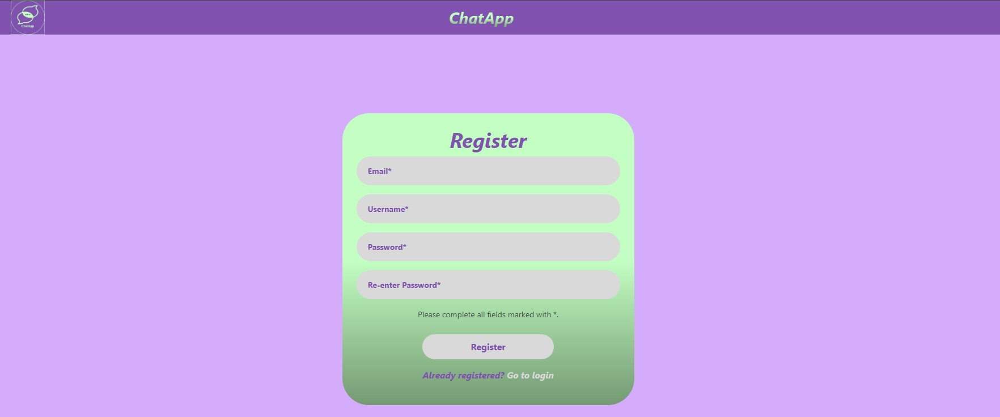
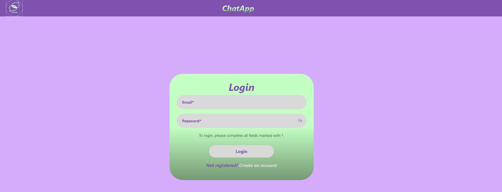
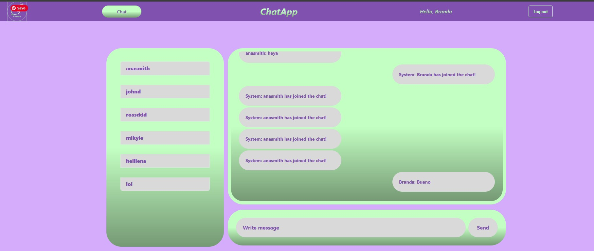
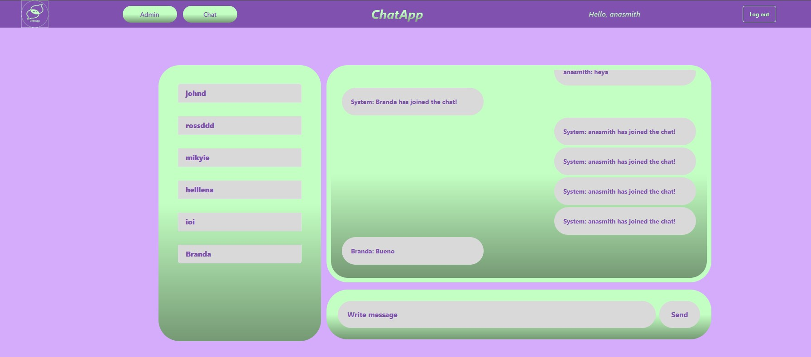
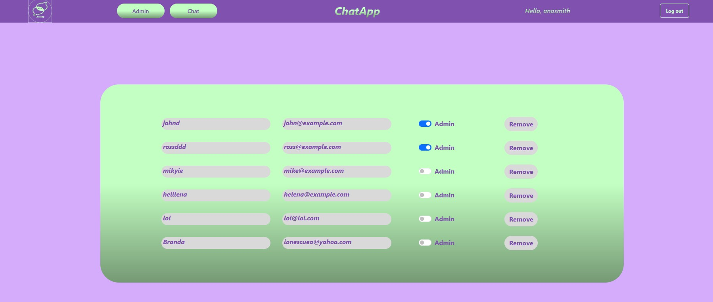
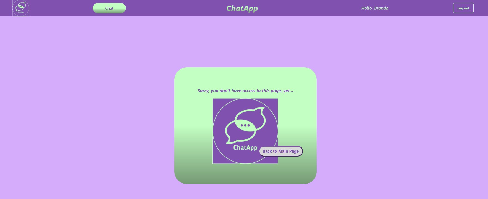

# ChatApp-React
A real-time chat app

## Description
ChatApp-React is a real-time chat application built using React, allowing users to communicate with each other in real-time. The app features a simple and intuitive interface, making it easy for users to send and receive messages.

The app was first created on [Figma](public/ChatApp-Figma.png).

There is already a list of users saved in the local storage, as the app has also a role based access setup. The list of pre-existent users can be accessed here [originalUsers](utilities/usersLS.js#originalUsers).

## Live Demo
You can try out the app live at on Netlify [ChatApp](https://anotherchatapp.netlify.app/).

## Server
The server is hosted on Render, ensuring that the app remains live and available 24/7.

## Installation
To install the app locally, follow these steps:

1. Clone the repository using `git clone https://github.com/ionescuea/ChatApp-React`
2. Navigate to the project directory using `cd ChatApp-React`
3. Install the dependencies using `npm install`
4. Start the app using `npm start`

## Usage
To use the app, simply navigate to `http://localhost:3000` in your web browser or directly on your browser at https://anotherchatapp.netlify.app/.

On the Main page, you can register a new account or log in to an existing one to start chatting with other users.

Once logged in with credentials, the user is directed to the Chat page.

Some of the users from [originalUsers](utilities/usersLS.js#originalUsers) have an admin role, so once those users are logged in, they can see the Admin button on the nav bar.

The users who have the admin role, can access the admin page and grant admin role to oter logged users, cancel the admin role for others or remove their credentials from the app.

The users who don't have the admin role and try to logg in onto it, they will receive a Page Not Found message and the option to return to the Main page.

## Credits
ChatApp-React was built using the following technologies:

* React
* WebSocket
* Bootstrap
* Figma

## Deployment
The app is deployed on Netlify, and the server is hosted on Render.

## Licence
Licensed under the [MIT](LICENSE) license.